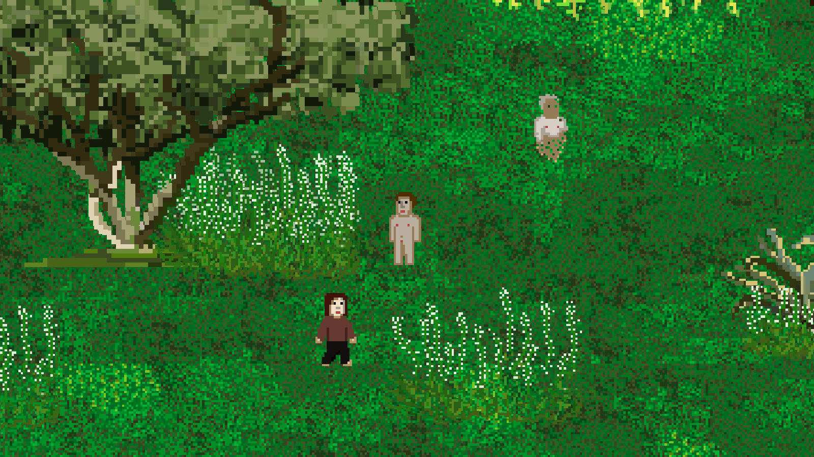

# Human2D_Game_w_Unity

A draft version of a game I made with Unity and Aseprite. There's no objective yet; it is more of a sandbox to try out some artwork and character behaviors. You can explore the environment and interact with some elements.

## Features
- **Art Style**: Designed with pixel art created in Aseprite.
- **Character Movement**: Navigate using `W`, `A`, `S`, `D` keys.
- **Exit Game**: Close the application with `Alt + F4` (Windows).

## Controls
- **Movement**: `W`, `A`, `S`, `D`
- **Exit Game**: `Alt + F4` (Windows)

## Preview

## How to Play
1. Download the game from the [Releases](#).
2. Extract the files and run the executable.
3. Use the controls to move around and explore the world.

## Tools Used
- **Unity**: Game engine.
- **Aseprite**: Pixel art creation.

## Contribution
This project is currently in its draft phase. Contributions are welcome! Feel free to fork the repository and submit pull requests.

## License
[MIT License](LICENSE)

---

Feel free to share your feedback or report issues in the [Issues](#) section!
